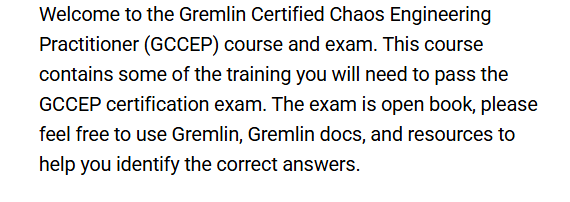
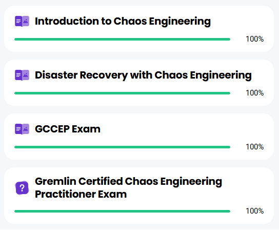

# 🛠️ Chaos Engineering Practitioner – Gremlin

This repository contains **notes, labs, research materials, references, and certificate of completion** for the *Chaos Engineering Practitioner – Gremlin* program.  
The course provides a comprehensive introduction to **chaos engineering principles, hypothesis design, failure injection, observability, resilience patterns, and security & compliance in distributed systems**.

---

## 📚 Notes
- 📘 [01-introduction.md](./notes/01-introduction.md) – Introduction to chaos engineering  
- 📘 [02-chaos-principles.md](./notes/02-chaos-principles.md) – Core principles of chaos engineering  
- 📘 [03-hypothesis-design.md](./notes/03-hypothesis-design.md) – Designing hypotheses for experiments  
- 📘 [04-metrics-and-sla.md](./notes/04-metrics-and-sla.md) – Metrics and SLA considerations  
- 📘 [05-failure-injection-methods.md](./notes/05-failure-injection-methods.md) – Failure injection techniques  
- 📘 [06-observability-and-monitoring.md](./notes/06-observability-and-monitoring.md) – Observability best practices  
- 📘 [07-experiment-safety-and-blast-radius.md](./notes/07-experiment-safety-and-blast-radius.md) – Managing experiment safety and blast radius  
- 📘 [08-gremlin-platform-basics.md](./notes/08-gremlin-platform-basics.md) – Gremlin platform overview  
- 📘 [09-chaos-at-scale.md](./notes/09-chaos-at-scale.md) – Scaling chaos experiments  
- 📘 [10-resilience-patterns.md](./notes/10-resilience-patterns.md) – Resilience patterns in distributed systems  
- 📘 [11-chaos-in-cicd.md](./notes/11-chaos-in-cicd.md) – Integrating chaos into CI/CD pipelines  
- 📘 [12-security-and-compliance.md](./notes/12-security-and-compliance.md) – Security and compliance considerations  

---

## 🧪 Labs
- 🧱 [controlled-failure-injection.md](./labs/controlled-failure-injection.md) – Hands-on controlled failure experiments  
- 🧑‍💻 [gremlin-getting-started.md](./labs/gremlin-getting-started.md) – Gremlin platform labs  
- 🛡️ [resilience-validation.md](./labs/resilience-validation.md) – Validating system resilience  

---

## 🔬 Research / Misc
- 📄 [changelog.md](./misc/changelog.md) – Project updates and notes  
- 📄 [diagrams.md](./misc/diagrams.md) – Diagrams of experiments  
- 📄 [experiment-reports.md](./misc/experiment-reports.md) – Reports on chaos experiments  
- 📄 [personal-reflection.md](./misc/personal-reflection.md) – Personal reflections  

---

## 📖 Docs
- 📘 [index.md](./docs/index.md) – Course index and structure  
- 📘 [roadmap.md](./docs/roadmap.md) – Learning roadmap for chaos engineering  
- 📘 [syllabus.md](./docs/syllabus.md) – Official course syllabus  
- 📘 [glossary.md](./docs/glossary.md) – Common chaos engineering terms  
- 📘 [references.md](./docs/references.md) – External references and reading list  

---

## 🧩 Extras
- 🗂️ [case-studies.md](./extras/case-studies.md) – Real-world chaos engineering implementations  
- 🧰 [resources.md](./extras/resources.md) – Tools and learning resources  
- 🕰️ [timeline.md](./extras/timeline.md) – History and evolution of chaos engineering  

---

## 📸 Screenshots

| Section | Screenshot |
|--------------------------|------------|
| 🧭 Course Overview |  |
| 📘 Course Curriculum |  |

---

## 📜 Certificate
🎓 [Chaos Engineering Practitioner – Gremlin Certificate](./cert/4d0d145e-d6bd-4194-85a8-d15aa1556d45.pdf)
This certificate confirms the successful completion of the **Chaos Engineering Practitioner – Gremlin** program, covering chaos engineering principles, hypothesis design, failure injection methods, observability, blast radius management, resilience patterns, and security & compliance in large-scale systems.

---

## 📝 Personal Review
This program provided a **strong foundation in chaos engineering**, including **experiment design, system resilience, and platform-specific practices using Gremlin**.  
Through hands-on labs and structured exercises, I gained practical experience in **failure injection, observability, and mitigating risk in complex systems**.  
Highly recommended for anyone pursuing **resilience engineering and system reliability**.

---

## ✍️ Author  

**Thành Danh** – Red Team Learner & Security Researcher  

- GitHub: [@ngvuthdanhh](https://github.com/ngvuthdanhh)  
- Email: ngvu.thdanh@gmail.com   

---

## 📄 License  

This project is licensed under the terms of the **MIT License**.  
See [`LICENSE`](./LICENSE) for full details.  

© 2025 ngvuthdanhh. All rights reserved.  
